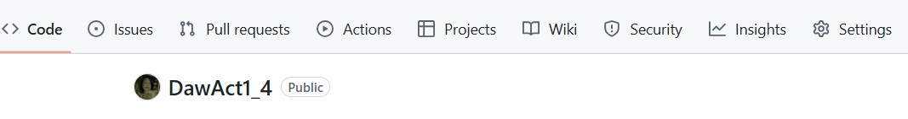
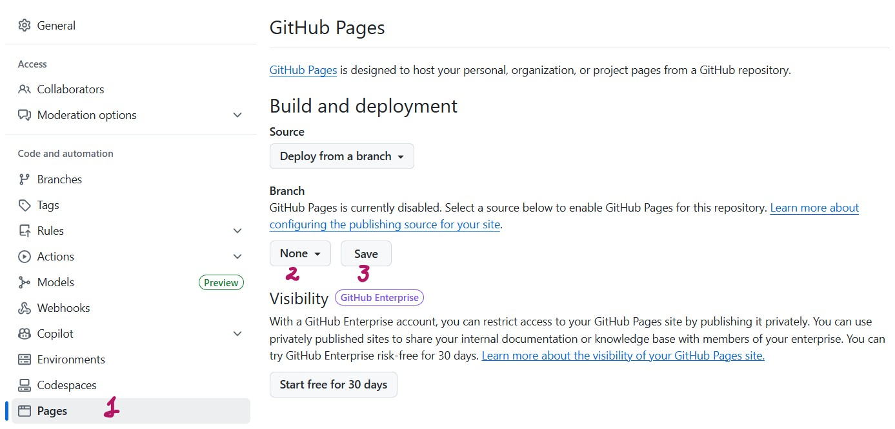
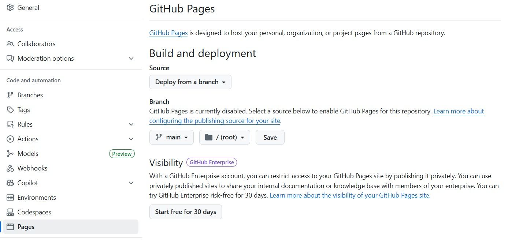

# Breve resumen uso del lenguaje Markdown y GitHub Pages
Mencionaremos algunas particularidades del lenguaje Markdown para el archivo README y el servicio GitHub Pages, que nos permite publicar una web estática que está vinculada automáticamente con nuestro repositorio y refleja instantáneamente los cambios que vayamos haciendo. 

### Introduccción a Markdown
Github permite crear documentación de forma sencilla generando un archivo llamado 
README.md. También permite crear una web propia para el proyecto y, además, una wiki. Para 
marcar el texto, se utiliza un lenguaje de marcado de texto denominado Markdown. 
Markdown es un lenguaje de marcado ligero que trata de conseguir la máxima legibilidad y 
facilidad de publicación tanto en su forma de entrada como de salida, inspirándose en muchas 
convenciones existentes para marcar mensajes de correo electrónico usando texto plano. 
Esta es la sintaxis básica:

<table>
<tr style="background-color:#ADD8E6;">
    <th>Element</th>
    <th>Markdown syntax</th>
</tr>
  <tr>
    <td>Heading</td>
    <td># H1,  ## H2,  ### H3</td>
  </tr>
  <tr style="background-color:#0000FF;">
    <td>Bold</td>
    <td>**bold text**</td>
  </tr>
  <tr>
    <td>Italic</td>
    <td>_italicidez text_</td>
  </tr>
  <tr style="background-color:#ADD8E6;">
    <td>Blockquote</td>
    <td> > blockquote</td>
  </tr>
  <tr>
    <td>Ordered List</td>
    <td>
    <lu>
      <ol>1.- First item</ol>
      <ol>2.- Second item</ol>
      <ol>3.- Third item</ol>
    </lu>
    </td>
  </tr>
  <tr style="background-color:#0000FF;">
    <td>Unordered List</td>
    <td>
    <lu>
       <li> First item</li>
       <li> Second item</li>
       <li> Third item</li>
    </lu>
    </td>
  </tr>
  <tr>
    <td>Horizontal Rule</td>
    <td>---</td>
  </tr>
  <tr style="background-color:#ADD8E6;">
    <td>Link</td>
    <td>[title](https://www.example.com)</td>
  </tr>
  <tr>
    <td>Image</td>
    <td></td>
  </tr>
  <tr style="background-color:##0000FF;">
    <td>Code</td>
    <td>`code line`</td>
  </tr>
</table>

### Plantillas de referencias 
 Dentro de GitHub poedemos encontrar algunas plantillas que nos sirven de referencia.
 Algunos ejmeplos:

 [Readme-Template.md] (https://gist.github.com/PurpleBooth/109311bb0361f32d87a2)

 [Best-README_Template] (https://github.com/othneildrew/Best-README-Template)

# GitHub Pages
GitHub Pages es un servicio de GitHub que nos permite publicar una web estática vinculada 
automáticamente con nuestro repositorio, de manera que refleja casi al instante los cambios 
que vayamos haciendo en este último. Activar este servicio es muy sencillo.  
Primero necesitamos que el repositorio contenga un sitio web (al menos un fichero 
index.html) 

Vamos a Settings del repositorio

En el panel izquierdo seleccionamos Pages, y a continuación seleccionamos la rama que vamos 
a usar para crear la página y la ubicación. Fíjate que podría ser una carpeta del repositorio, podemos seleccionar main / (root ) y pulsa Save, verás que donde ponía GitHub Pages is currently disabled ahora pone Your GitHub Pages site is currently being built from the 
main branch.

En la parte de arriba de la página habrá aparecido la dirección en la que se ha desplegado la página, que se forma con tu nombre de usuario y el nombre del repositorio: 

